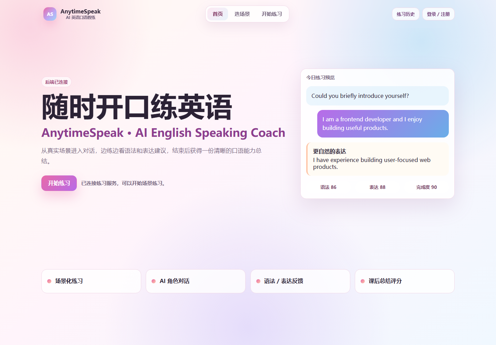
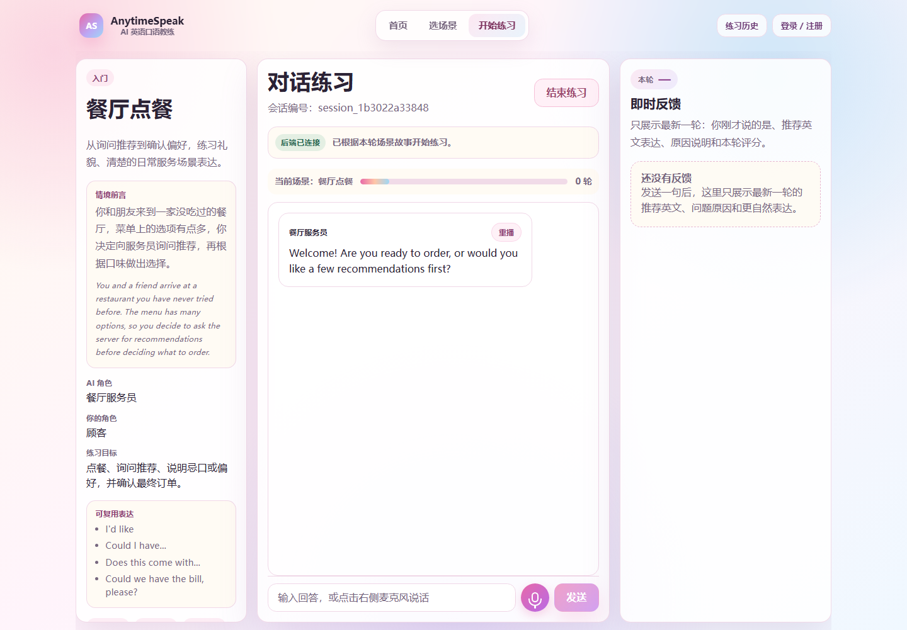
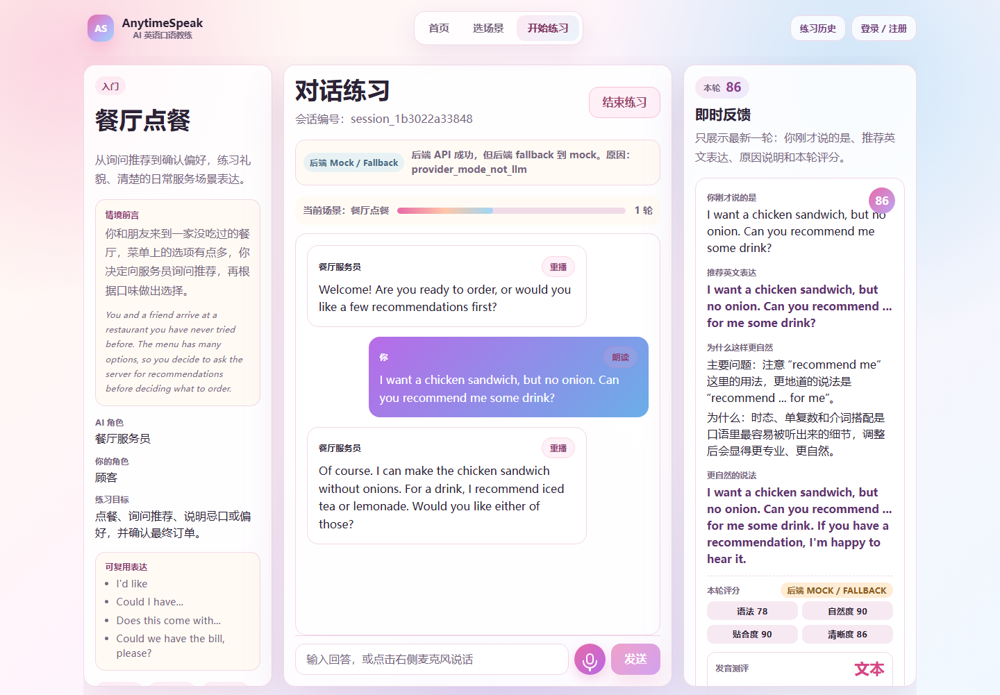
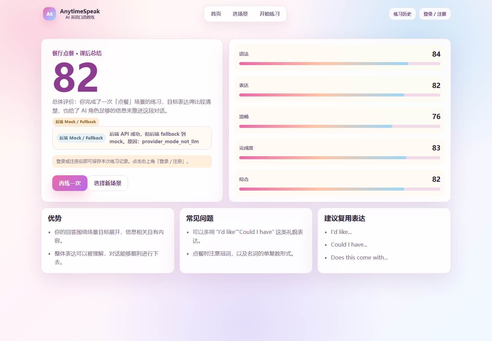
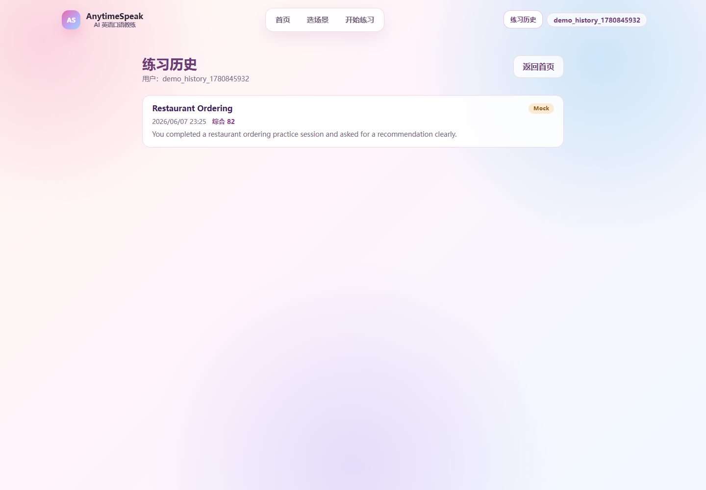

# AnytimeSpeak: AI 英语口语陪练

AnytimeSpeak 是一个面向英语口语练习的 AI 陪练工具。用户可以选择面试、会议、点餐、旅行、日常交流等真实场景，与 AI 角色进行英语对话训练，并在练习过程中获得表达建议、语法反馈和发音测评。

项目目标是做出一条稳定、可演示、可复现的 MVP 链路：选择场景 -> 开始 session -> 语音或文本对话 -> 查看即时反馈 -> 结束练习 -> 查看评分总结 -> 回看历史记录。界面以中文为主，练习内容和推荐表达保持英文，视觉风格偏 Taylor Swift Lover 风格的柔和粉紫色系。

即使没有任何 API key，项目也可以通过 mock fallback 跑通完整 demo。LLM、豆包 ASR、科大讯飞发音测评等外部能力均通过环境变量配置；未配置或调用失败时，系统会回退到稳定的本地/mock 路径，不会把密钥暴露给前端。

## 核心功能

- 场景选择与 story seed：每个场景包含固定故事种子、中英文场景介绍、AI 角色、用户角色、目标和实用表达。
- AI 场景化对话：后端基于 session、场景、最新用户输入和历史对话生成角色回复。
- 中英文混合输入支持：文本输入始终可用，语音识别可识别中英混合转写。
- 即时反馈：推荐英文表达、主要问题、原因解释、更自然说法、语法/自然度/相关性/清晰度评分。
- 课后总结与量化评分：结束练习后生成优势、重复问题、可复用表达、场景完成度、下一步建议和 0-100 分评分。
- 语音输入与播放：支持浏览器 `SpeechRecognition`、可选豆包实时 ASR、AI 回复自动播放、用户录音回放和文本 fallback。
- 用户注册/登录与历史记录：支持用户名密码登录，使用 SQLite 保存练习 session、消息、反馈和总结。
- 发音测评：语音轮次可调用 `/api/pronunciation/assess`，默认启用 transcript-based `heuristic_mock` fallback，可选接入科大讯飞 XFYUN ISE。
- Provider badge：chat、feedback、summary、pronunciation 响应带 provider/fallback 信息，前端可展示结果来自真实 provider 还是 mock fallback。

## 项目截图

截图位于 `docs/assets/`，使用本地 mock/demo 数据生成，不包含 `.env`、API key、token 或真实个人隐私。











## 技术架构

- Frontend: React + Vite + TypeScript。
- Backend: FastAPI + Python。
- AI provider: 通过环境变量配置 LLM provider；默认 `LLM_PROVIDER_MODE=mock`，真实 provider 缺失或失败时回退到 backend mock。
- Speech/ASR: 浏览器语音识别作为默认 fallback；`ASR_PROVIDER_MODE=doubao` 且配置凭据后，后端通过 `/ws/asr` 代理豆包 BigModel Streaming ASR。
- Pronunciation: `/api/pronunciation/assess` 支持本地启发式 fallback、通用 API provider 占位和科大讯飞 XFYUN ISE provider。
- SQLite: 用于本地用户名密码用户、练习历史、消息、反馈和总结；运行时数据库文件位于 `backend/data/`，不提交到仓库。

简要链路：

```text
用户选择场景 -> 创建 session -> 语音或文本输入 -> AI 回复
-> 即时反馈 / 发音测评 -> 结束练习 -> 课后总结 -> 保存历史
```

## 目录结构

- `frontend/`: React + Vite + TypeScript 前端。
- `backend/`: FastAPI 后端、provider fallback、SQLite 历史服务和测试。
- `docs/`: API 契约、产品设计、demo 脚本、提交核查和场景 prompt 资料。
- `scripts/`: 一键启动和停止开发服务脚本。
- `README.md`: 项目说明、运行方式、截图和最终提交信息。
- `AGENTS.md`: 仓库协作规则和 PR 约束。

## 本地运行

### 方式一：一键启动

先安装依赖：

```bash
cd frontend
npm install
cd ../backend
pip install -r requirements.txt
```

从项目根目录启动前后端：

```bash
npm run dev
```

停止服务：

```bash
npm run stop
```

Windows 下会分别打开前端和后端终端窗口；macOS/Linux 可使用 `sh scripts/dev.sh` 和 `sh scripts/stop-dev.sh`。

### 方式二：分别启动

前端：

```bash
cd frontend
npm install
npm run dev
```

后端：

```bash
cd backend
pip install -r requirements.txt
python -m uvicorn app.main:app --reload --host 0.0.0.0 --port 8000
```

Health check：

```bash
curl http://127.0.0.1:8000/api/health
```

预期响应：

```json
{"status":"ok"}
```

## 环境变量说明

复制 `.env.example` 为 `.env` 后可配置真实 provider。本地 demo 不需要真实 key，默认 mock/browser fallback 可用。不要提交 `.env` 或真实 key。

LLM：

- `LLM_PROVIDER_MODE`: `mock` 或 `llm`。
- `LLM_API_KEY` / `OPENAI_API_KEY`: LLM API key，二者均为空时回退 mock。
- `LLM_BASE_URL`: OpenAI-compatible API base URL。
- `LLM_MODEL`: 模型名称。

豆包 ASR：

- `ASR_PROVIDER_MODE`: 默认 `browser`；设置为 `doubao` 后尝试走后端 WebSocket ASR。
- `DOUBAO_API_KEY`: 新控制台 App Key。
- `DOUBAO_APP_ID` / `DOUBAO_ASR_TOKEN`: 旧控制台凭据。
- `DOUBAO_RESOURCE_ID`: BigModel ASR 资源 ID。
- `DOUBAO_ASR_URL`: 可选 ASR WebSocket 地址，默认 `bigmodel_async`。
- `DOUBAO_RESULT_TYPE`: `full` 或 `single`。

发音测评：

- `PRONUNCIATION_PROVIDER_MODE`: 默认 `mock`；可选 `api` 或 `xfyun`。
- `PRONUNCIATION_API_KEY` / `PRONUNCIATION_API_BASE_URL` / `PRONUNCIATION_MODEL`: 通用发音测评 API 配置。
- `XFYUN_APP_ID` / `XFYUN_API_KEY` / `XFYUN_API_SECRET`: 科大讯飞 ISE provider 凭据。
- `XFYUN_ISE_BASE_URL` / `XFYUN_ISE_LANGUAGE` / `XFYUN_ISE_CATEGORY` / `XFYUN_ISE_AUDIO_FORMAT`: XFYUN ISE 可选覆盖项。

## API 概览

当前 main 已实现：

- `GET /api/health`
- `GET /api/scenarios`
- `POST /api/sessions`
- `POST /api/chat`
- `POST /api/feedback`
- `POST /api/summary`
- `GET /api/asr/mode`
- `WebSocket /ws/asr`
- `POST /api/pronunciation/assess`
- `POST /api/users/register`
- `POST /api/users/login`
- `GET /api/users/{user_id}`
- `POST /api/history/sessions`
- `GET /api/history/sessions`
- `GET /api/history/sessions/{session_id}`

详细字段见 [docs/api-contract.md](docs/api-contract.md)。

## Demo 说明

推荐使用 mock mode 或测试 key 录制。录屏时不要展示 `.env`、API key、token、真实数据库文件或私人账号信息。

推荐流程：

1. 注册或登录测试用户。
2. 选择一个场景，阅读 story seed。
3. 使用语音或文本进行 1-2 轮对话。
4. 查看即时反馈和 provider badge。
5. 如果使用语音，展示发音测评小面板和录音回放。
6. 结束练习，查看课后总结与评分。
7. 打开历史记录，查看已保存 session。

Demo 视频链接：TBD

录制脚本见 [docs/demo-script.md](docs/demo-script.md)。

## 第三方依赖与 API 使用说明

- 前端：React、React DOM、Vite、TypeScript。
- 后端：FastAPI、Uvicorn、Pytest、HTTPX、python-dotenv、python-multipart、websockets、volcengine-audio。
- LLM API：通过 OpenAI-compatible 环境变量配置；mock fallback 默认可用。
- ASR API：可选豆包 BigModel Streaming ASR，凭据仅在后端读取。
- 发音测评 API：可选科大讯飞 XFYUN ISE 或通用 API provider，凭据仅在后端读取。
- AI 代码辅助说明：本项目开发过程中使用 AI coding assistant 辅助生成代码与文档；核心功能逻辑、集成方式和验收由项目作者维护。

## 安全说明

- 不提交 API key、token、`.env`、真实 SQLite 数据库或私人凭据。
- `.gitignore` 已覆盖环境文件、数据库文件、`node_modules`、build 产物和缓存目录。
- mock mode 保证无 key 场景下仍可复现 demo。
- 截图和 demo 视频不得展示 `.env`、provider 控制台、真实账号或真实数据库内容。

## 后续扩展方向

- 端到端实时语音大模型：更低延迟的语音输入、语音理解、AI 对话和语音输出闭环。
- 更精细的发音测评：音素级错误定位、重音、节奏和可视化跟读训练。
- 更稳定的云端历史与多设备同步。
- 个性化学习路径与长期能力曲线。
- 更多场景、难度等级和可复习的表达库。
